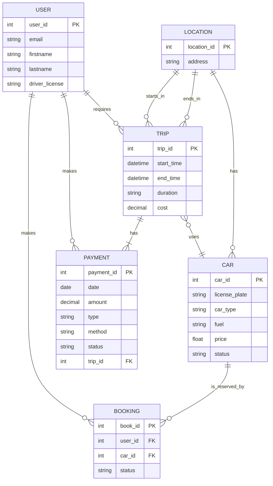

```
erDiagram
USER {
int user_id PK
string email
string firstname
string lastname
string driver_license
}
CAR {
int car_id PK
string license_plate
string car_type
string fuel
float price
string status
}
LOCATION {
int location_id PK
string address
}
TRIP {
int trip_id PK
datetime start_time
datetime end_time
string duration
decimal cost
}
BOOKING {
int book_id PK
int user_id FK
int car_id FK
string status
}
PAYMENT {
int payment_id PK
date date
decimal amount
string type
string method
string status
int trip_id FK
}
USER ||--o{ BOOKING : makes
USER ||--o{ TRIP : requires
CAR ||--o{ BOOKING : is_reserved_by
USER ||--o{ PAYMENT : makes
TRIP ||--|{ PAYMENT : has
TRIP }o--|| CAR : uses
LOCATION ||--o{ TRIP : starts_in
LOCATION ||--o{ TRIP : ends_in
LOCATION ||--o{ CAR : has
```

