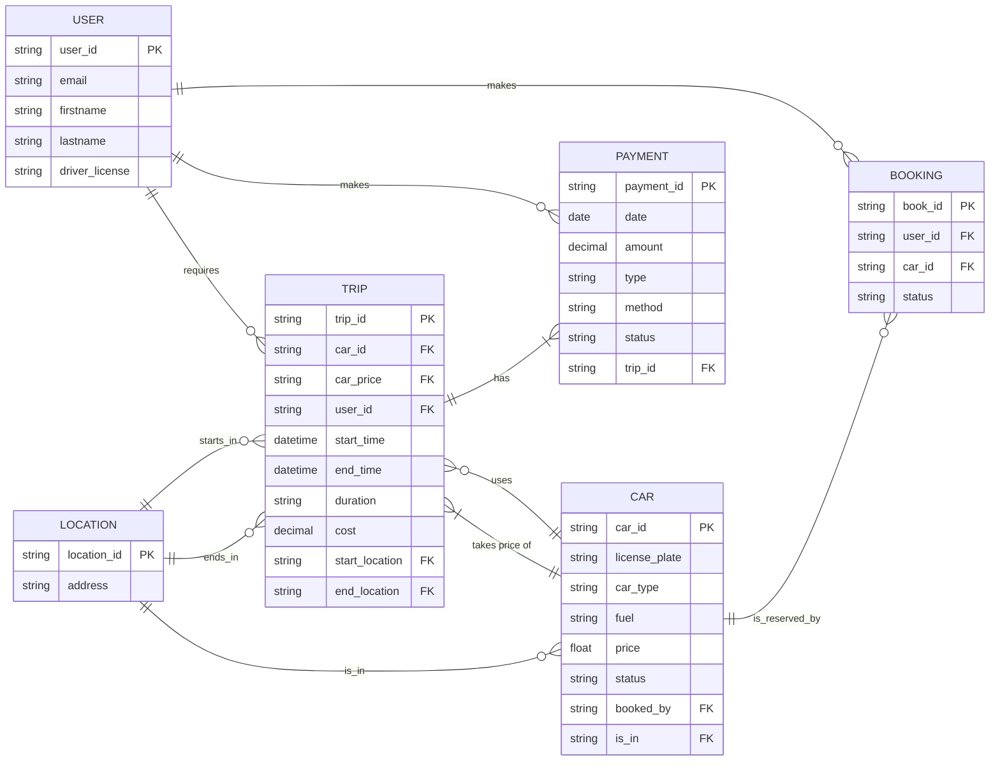

```
erDiagram
direction LR
USER {
string user_id PK
string email
string firstname
string lastname
string driver_license
}
CAR {
string car_id PK
string license_plate
string car_type
string fuel
float price
string status
string booked_by FK
string is_in FK
}
LOCATION {
string location_id PK
string address
}
TRIP {
string trip_id PK
string car_id FK
string car_price FK
string user_id FK
datetime start_time
datetime end_time
string duration
decimal cost
string start_location FK
string end_location FK
}
BOOKING {
string book_id PK
string user_id FK
string car_id FK
string status
}
PAYMENT {
string payment_id PK
date date
decimal amount
string type
string method
string status
string trip_id FK
}

    USER||--o{BOOKING:"makes"
    USER||--o{TRIP:"requires"
    CAR||--o{BOOKING:"is_reserved_by"
    USER||--o{PAYMENT:"makes"
    TRIP||--|{PAYMENT:"has"
    TRIP}o--||CAR:"uses"
    TRIP}|--||CAR:"takes price of"
    LOCATION||--o{TRIP:"starts_in"
    LOCATION||--o{TRIP:"ends_in"
    LOCATION||--o{CAR:"is_in"
```


