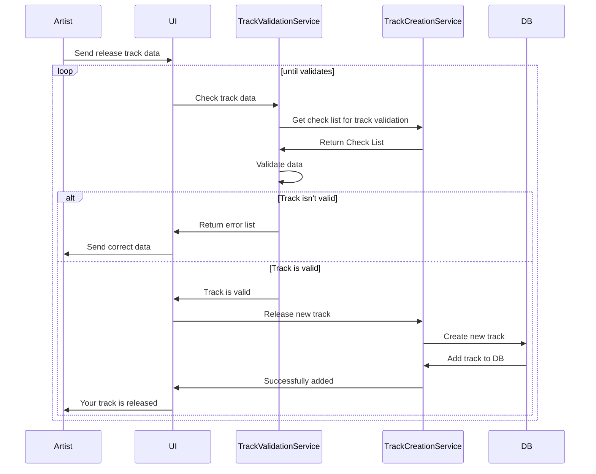

```
sequenceDiagram
    participant Artist
    participant UI
    participant TrackValidationService
    participant TrackCreationService
    participant DB

    Artist->>UI: Send release track data
    loop until validates
        UI->>TrackValidationService: Check track data
        TrackValidationService->>TrackCreationService: Get check list for track validation
        TrackCreationService->>TrackValidationService: Return Check List
        TrackValidationService->>TrackValidationService: Validate data
        alt Track isn't valid
            TrackValidationService->>UI: Return error list
            UI->>Artist: Send correct data
        else Track is valid
            TrackValidationService->>UI: Track is valid
            UI->>TrackCreationService: Release new track
            TrackCreationService->>DB: Create new track
            DB->>TrackCreationService: Add track to DB
            TrackCreationService->>UI: Successfully added
            UI->>Artist: Your track is released
        end
    end
```


